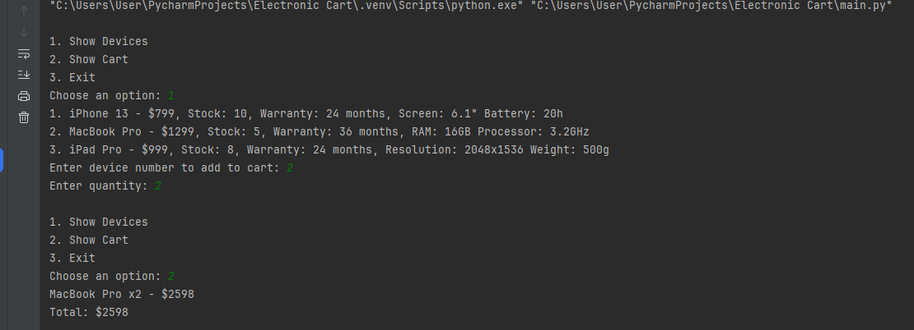
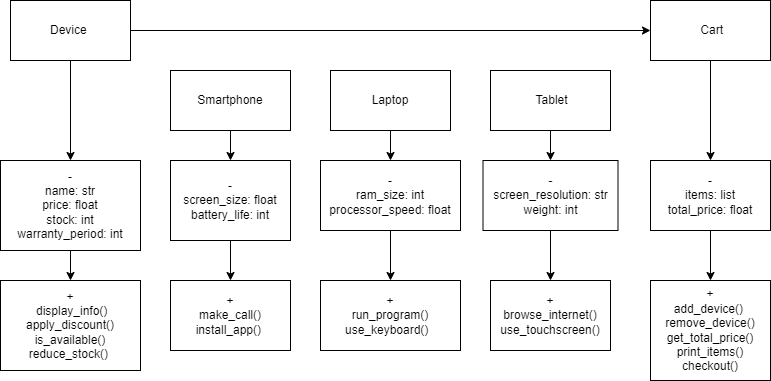

# Electronic Device Shopping Cart

## 📌 Description
This is a simple shopping cart system for an electronic device store.  
Customers can browse products, add items to their cart, and complete a purchase.  
The system manages stock and applies discounts.  

## 🛠 Features
- Display available devices (Smartphones, Laptops, Tablets).
- Add devices to a shopping cart.
- Apply discounts to items.
- Checkout and update stock.

## 🚀 How to Run the Project
1. Clone this repository:
   ```bash
   git clone https://github.com/aiday1/electronic-device-shopping-cart.git
2. Navigate to the project folder:
    ```bash
    cd electronic-cart
3. Run the program:
    ```bash
   python main.py
📷 Sample Output

🛠 Classes

Device (Base class)
Smartphone, Laptop, Tablet (Inherit from Device)
Cart (Manages items in the cart)

📌 UML Diagram


👨‍💻 Author
Aidai